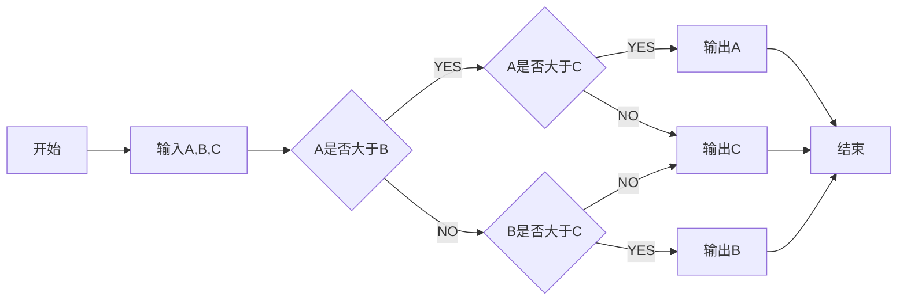

# Welcome  

作为测试的第一篇博客，惯例`Hello World`，顺便熟悉一下`markdown`语法。

``` cpp
#include<iostream>

using namespace std;

int main(){
	cout<<"hello world";
	return 0;
}
```

```flow

st=>start: 开始
op=>operation: My Operation
cond=>condition: Yes or No?
e=>end
st->op->cond
cond(yes)->e
cond(no)->op

```



$E=m^c$


$$
1024=2^{10}
$$

***