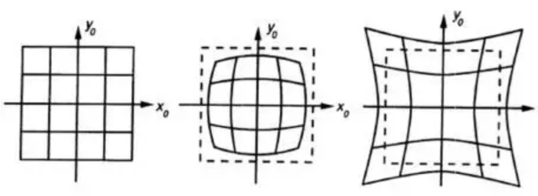

# 一、基本知识

## 齐次坐标

把维数为n维的向量用一个n+1维向量来表示（如x，y，z转换为x，y，z，w），齐次坐标有以下**性质**：

以齐次坐标表表示的点，若该坐标内的数值**全乘上一相同非零实数**，仍会表示该点；

两个齐次坐标表示同一点，当且仅当**其中一个齐次坐标可由另一个齐次坐标乘上一相同非零常数**得取得；

当 Z 不为 0，则该点表示欧氏平面上的$(X/Z,Y/Z)$；

当 Z 为 0，则该点表示一无穷远点；

原点表示为$(0, 0, 1)$。

## 旋转矩阵和平移变量

向量在三维坐标的旋转可以通过$\vec{b}=R\vec{a}$实现，其中R为**针对三个坐标轴**的旋转矩阵的乘积：$R=R_zR_yR_x$，即分别绕x、y、z轴旋转α、β、θ的角度。

$R_x=\begin{bmatrix}1 & 0 & 0 \\ 0 &\cos{\alpha} &\sin{\alpha}\\ 0 & -\sin{\alpha} & \cos{\alpha} \end{bmatrix}$

$R_y=\begin{bmatrix}\cos{\beta} & 0 & -\sin{\beta}\\ 0&1&0\\ \sin{\beta} & 0 & \cos{\beta} \end{bmatrix}$

$R_z=\begin{bmatrix} \cos{\theta} &  \sin{\theta} &0\\ -\sin{\theta} & \cos{\theta} &0 \\ 0&0&1 \end{bmatrix}$

平移变量用来表示将**一个坐标系的原点**移动到**另一个坐标系的原点**，即T=目标原点-摄像机原点，

## 透镜畸变

透镜的畸变主要分为径向畸变和切向畸变：

**径向畸变**是由于透镜形状的制造工艺导致，远离透镜中心的光线的弯曲程度比靠近中心的严重，导致正方形在经过透镜形成图像之后，边会弯曲。下图所示是径向畸变的两种类型：桶形畸变和枕形畸变：

实际情况中我们常用r=0处的泰勒级数展开的前几项来近似描述径向畸变。矫正径向畸变前后的坐标关系为：

$x_c=x(1+k_1r^2+k_2r^4+k_3r^6)$

$y_c=y(1+k_1r^2+k_2r^4+k_3r^6)$

因此，为了矫正径向畸变，我们需要三个参数$k_1,k_2,k_3$。

**切向畸变**是由于透镜安装位置误差导致。因此，如果存在切向畸变，一个矩形被投影到成像平面上时，很可能会变成一个梯形。切向畸变需要两个额外的畸变参数来描述，矫正前后的坐标关系为：

$x_c=x+[2p_1y+p_2(r^2+2x^2)]$

$y_c=y+[2p_2x+p_1(r^2+2y^2)]$

因此，为了矫正切向畸变，我们需要两个参数$p_1,p_2。

# 二、相机成像几何模型

## 坐标系

为了将三维物体映射到二维图像之中，我们需要建立坐标系，可以建立以下四个坐标系用以转换：

**世界坐标系**：Xw、Yw、Zw，三维世界的坐标系，为了描述目标物在真实世界里的位置而被引入。单位为m。

**相机坐标系**： Xc、Yc、Zc，在相机上建立的坐标系，为了从相机的角度描述物体位置而定义，作为沟通世界坐标系和图像/像素坐标系的中间一环。单位为m。

**图像坐标系**：x、y，为了描述成像过程中物体从相机坐标系到图像坐标系的投影透射关系而引入，方便进一步得到像素坐标系下的坐标。 单位为m。

**像素坐标系**：u、v，为了描述物体成像后的像点在数字图像上（相片）的坐标而引入，是我们真正从相机内读取到的信息所在的坐标系。单位为个（像素数目）。

其中图像坐标系与相机坐标系的XY平面平行，它们之间的距离为焦距f，相机坐标系的原点为焦点，Z轴为光轴。

为了将世界坐标系的坐标$(x,y,z)$转换为像素坐标系的坐标$(u,v)$，我们可以经过以下的转换：

### 1、世界坐标系->相机坐标系

我们想要得到$X_w\rightarrow X_c$的转换，可以直接通过**平移**与**旋转**实现，根据矩阵知识，可以通过$X_w=MX_c$完成转换，我们将其变换矩阵由一个**旋转矩阵**和**平移向量**组合成的**齐次坐标矩阵**M来表示：

变换矩阵$M=\begin{bmatrix} R &0\\ 0_3^T & t \end{bmatrix}$其中，R为旋转矩阵，t为平移向量（具体定义在上文中提到），其中变换矩阵即为外参矩阵，只与相机外部参数有关，且外参矩阵随物体位置的变化而变化。

### 2、相机坐标系->理想图像坐标系（不考虑畸变）

这一过程进行了从三维坐标到二维坐标的转换，也即投影透视过程。我们还是拿针孔成像来说明，成像过程如图：针孔面（相机坐标系）在图像平面（图像坐标系）和物点平面（棋盘平面）之间，所成图像为倒立实像。

但是为了在数学上更方便描述，我们将图像平面以焦点为轴进行180°的旋转，得到下图所示的坐标系：

此时，假设相机坐标系中有一点M，则在理想图像坐标系下的成像点P的坐标为（可由相似三角形原则得出）：

$x_p=\frac{f}{Z}x_m,y_p=\frac{f}{Z}y_m$

将上式化为齐次坐标表示形式为：

### 3、理想图像坐标系->实际图像坐标系（考虑畸变）

由上文提到的透镜畸变的知识，我们一共需要5个畸变参数（k1、k2、k3、p1和p2 ）来描述透镜畸变。这五个参数为内参数，由摄像机本身决定，不随物体位置变化而变化。

### 4、实际图像坐标系->像素坐标系

这一转换只需要经过简单的平移，假设图像坐标系原点在像素坐标系下的坐标为$(u_0，v_0)$，每个像素点在图像坐标系x轴、y轴方向的尺寸为：$d_x、d_y$，且像点在实际图像坐标系下的坐标为$x_c，y_c)$，于是可得到像点在像素坐标系下的坐标为：

$u=u_0+\frac{x_c}{d_x},v=v_0+\frac{y_c}{d_y}$

化为齐次坐标表示形式可得：

最后回到一整个流程（忽略透镜畸变）：

## 棋盘

棋盘是一块由黑白方块间隔组成的标定板，我们用它来作为相机标定的**标定物**（从真实世界映射到数字图像内的对象）。相对于复杂的三维物体，平面棋盘模式更容易处理，但与此同时，二维物体相对于三维物体会缺少一部分信息，于是我们会多次改变棋盘的方位来捕捉图像，以求获得更丰富的坐标信息。

