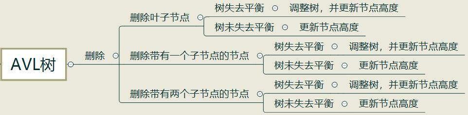

# 树

普通树的**结点树至少为1，不能为空；而二叉树可以为空**。

## 一、树的存储设计

### 1、双亲表示法（数组）

简单的数组储存，数组内容为：

| adr  | info | parent |
| ---- | ---- | ------ |
| 0    | A    | -1     |
| 1    | B    | 0      |
| 2    | C    | 0      |
| 3    | D    | 2      |

```cpp
class Tree{
	   elemtype info;
    int par;
};
```

### 2、子女表示法（链表）

每个元素对应一个child链表，按顺序指向每一个孩子：

| adr  | info | child  |
| ---- | ---- | ------ |
| 0    | A    | ->1->2 |
| 1    | B    | ^      |
| 2    | C    | ->3    |
| 3    | D    | ^      |

```cpp
class Tree{
	   elemtype info;
    node* child;
};
```

### 3、子女兄弟表示法

每个元素拥有两个指针，一个指向它的第一个孩子，另一个指向它的下一个兄弟：

| FirstChild | info | NextSibling |
| ---------- | ---- | ----------- |
| B          | A    | ^           |
| ^          | B    | C           |
| D          | C    | ^           |
| ^          | D    | ^           |

```cpp
class  TreeNode{
	   elemtype info;
    TreeNode *FirstChild,*NextSibling;
};
```

## 二、二叉树遍历

### 1、二叉树存储结构：

```cpp
class TreeNode{
	elemtype data;
  TreeNode *lchild,*rchild;
  TreeNode(elemtype D,TreeNode *lc=NULL,TreeNode *rc=NULL){
  	data=D;
  	lchild=lc;
  	rchild=rc;
  }
};
```

### 2、遍历：

```cpp
/*
前序遍历
*/
void PreTra(TreeNode *T){
    if(T==NULL)return;
    cout<<T->data;//此处对结点进行操作
    PreTra(T->lchild);
    PreTra(T->rchild);
    return;
}
```
```cpp
/*
中序遍历
*/
void InTra(TreeNode *T){
    if(T==NULL)return;
    InTra(T->lchild);
    cout<<T->data;//此处对结点进行操作
    InTra(T->rchild);
    return;
}
```
```cpp
/*
后序遍历
*/
void PosTra(TreeNode *T){
    if(T==NULL)return;
    PosTra(T->lchild);
    PosTra(T->rchild);
    cout<<T->data;//此处对结点进行操作
    return;
}
```
除了先序遍历、中序遍历、后序遍历外，还可以对二叉树进行**层序遍历**。层序遍历就是从所在二叉树的根节点出发，自上而下，自左至右逐层访问树的结点的过程。

层序遍历的实现需要利用队列结构，首先将**根节点入队**，当队列中有元素时，执行以下操作：将队首元素出队，**对该元素进行操作，并将该元素的左子树、右子树依次入队。**

层序遍历并不需要用到递归。

```cpp
/*
层序遍历
*/
void LevelTra(TreeNode *T){
    if(T==NULL)return;
    queue<TreeNode*> Q;
    Q.push(T);
    while(!Q.empty()){
    	TreeNode *S=Q.front();
    	Q.pop();
        cout<<S->data;//对元素进行操作
        if(S->lchild))Q.push(S->lchild);
        if(S->rchild))Q.push(S->rchild);
    }
    return;
}
```

## 三、线索二叉树

### 1、存储设计

线索二叉树的存储与普通二叉树类似，但是左指针、右指针多了标识符`rtag`和，`ltag`，当`rtag`为1时，`rchild`表示后继，当`rtag`为0时，`rchild`表示右子树，左标识符同理。总而言之，**只利用二叉树的空指针表示线索**。

对一个确定的二叉树，分别有前序、中序、后序三种线索树，以下列二叉树为例：


它的前序遍历为ABDEC，则其前序线索树为：


### 2、线索化

```cpp
/*
假设已经构建好二叉树T，构建中序线索树
*/
TreeNode *pre=NULL;//用于前驱线索的构建
void InitTheading(Tree *T){
		if(T){
				InitTheading(T->lchild);
				//L
				if(T->ltag==1) T->lchild=pre;//前驱
				if(pre && pre->rtag==1) pre->rchild=T;//后继
				pre=T;
				//N
				InitTheading(T->lchild);
				//R
		}
		return;
}
```

线索化代码需要注意的细节是前驱后继的处理，这里使用了全局变量pre存储当前操作结点的前驱，并以此得到**结点T的前驱**与**结点pre的后继**。

为了得到前序/后序线索树，只需要将上述代码的LNR交换位置。

### 3、任一结点前驱后继的查找

对**前序线索树**来说，判断流程如下：


```cpp
//前驱：
  if (p->ltag==1) pre=p->lchild;
  else //如图
//后继：
  if (p->rtag==1) next=p->rchild;
  else{
      if (p->ltag==0) next=p->lchild;
      else next=p->rchild;
  }
```

对**中序线索树**来说，判断流程如下：


```cpp
//前驱：
  if (p->ltag==1) pre=p->lchild;
  else {
  	pre=p->lchild;
  	while(pre->rchild){
  	     pre=pre->rchild;
      }
  }
//后继：
  if (p->rtag==1) next=p->rchild;
  else{
    next=p->rchild;
        while(next->lchild){
  	     next=next->lchild;
      }
  }
```

对**后序线索树**来说，判断流程如下：


```cpp
//前驱：
  if (p->ltag==1) pre=p->lchild;
  else {
  	if(p->rtag==0)pre=p->rchild;
  	else pre=p->lchild;
  }
//后继：
  if (p->rtag==1) next=p->rchild;
  else //如图
```

## 四、哈夫曼树

给定N个权值作为N个叶子结点，构造一棵二叉树，若该树的带权路径长度达到最小，称这样的二叉树为哈夫曼树(Huffman Tree)。哈夫曼树是带权路径长度最短的树，权值较大的结点离根较近。

哈夫曼树可用于编码，在编码时，让使用频率高的用短码，使用频率低的用长码，以优化整个编码。一个编码集合中，任何一个字符的编码都不是另一个字符编码的前缀，这种编码叫作**前缀编码**。

其带权路径长度可以表示为$WPL=\sum_{k=1}^nw_kl_k$

### 1、存储设计

为了得到哈夫曼树，我们需要使用一种存储方式存储各个结点，为了便于算法计算，我们利用如下的结构作为结点：

```cpp
class TreeNode{
		int weight;
		int par;
		int lc,rc;
};
```
而且我们知道，当一棵哈夫曼树有$N$个叶结点时，它的结点总数为$2N-1$，所以数组`TreeNode arr[2*n-1]`就是我们的哈夫曼树。

### 2、算法描述

假设我们得到了如下的叶结点，我们要一步一步构造哈夫曼树：

| Adr  | weight | par  | lc   | rc   |
| ---- | ------ | ---- | ---- | ---- |
| 0    | 6      | -1   | -1   | -1   |
| 1    | 5      | -1   | -1   | -1   |
| 2    | 8      | -1   | -1   | -1   |
| 3    | 12     | -1   | -1   | -1   |
| 4    | 0      | -1   | -1   | -1   |
| 5    | 0      | -1   | -1   | -1   |
| 6    | 0      | -1   | -1   | -1   |

为了得到每一个结点，我们需要做如下步骤：

* 找到当前已有结点（0~k）中**无父结点中**最小的两个结点A、B，令其父节点为第k+1个结点。
* 第k+1个结点的权值为A与B的权值之和，令其左右子结点分别为A、B。
* 更新已有结点个数：k+=1。
* 将以上步骤循环n-1次，得到n-1个新结点，完成构造。

以上面为例，给出每一步的结果：

| Adr  | weight | par  | lc   | rc   |
| ---- | ------ | ---- | ---- | ---- |
| 0    | 6      | 4    | -1   | -1   |
| 1    | 5      | 4    | -1   | -1   |
| 2    | 8      | -1   | -1   | -1   |
| 3    | 12     | -1   | -1   | -1   |
| 4    | 11     | -1   | 0    | 1    |
| 5    | 0      | -1   | -1   | -1   |
| 6    | 0      | -1   | -1   | -1   |


| Adr  | weight | par  | lc   | rc   |
| ---- | ------ | ---- | ---- | ---- |
| 0    | 6      | 4    | -1   | -1   |
| 1    | 5      | 4    | -1   | -1   |
| 2    | 8      | 5    | -1   | -1   |
| 3    | 12     | -1   | -1   | -1   |
| 4    | 11     | 5    | 0    | 1    |
| 5    | 19     | -1   | 2    | 4    |
| 6    | 0      | -1   | -1   | -1   |


| Adr  | weight | par  | lc   | rc   |
| ---- | ------ | ---- | ---- | ---- |
| 0    | 6      | 4    | -1   | -1   |
| 1    | 5      | 4    | -1   | -1   |
| 2    | 8      | 5    | -1   | -1   |
| 3    | 12     | 6    | -1   | -1   |
| 4    | 11     | 5    | 0    | 1    |
| 5    | 19     | 6    | 2    | 4    |
| 6    | 31     | -1   | 3    | 5    |

### 3、代码实现

```cpp
#include <iostream>
#include <string>
#include <algorithm>

using namespace std;
 
class TreeNode{
	public:
	   int info,par,lc,rc;
	   TreeNode(){
        info=0; 
        par=lc=rc=-1;
	   }
};

void FindMin(int &min1,int &min2,int k,TreeNode *num){
//找到当前已有结点（0~k）中无父结点中最小的两个结点A、B
	for(int i=0;i<k;i++){
	   if(num[i].par==-1){
	       if(num[min1].info>num[i].info){
	           min1=i;
		  }
	   }
	}
	for(int i=0;i<k;i++){
	   if(num[i].par==-1 && i!=min1){
	       if(num[min2].info>num[i].info){
		      min2=i;
		  }
    }
	}
	return;
}

int main(){
    int n;
    cin>>n;
    TreeNode num[2*n-1];
    for(int i=0;i<n;i++)
    {
	       cin>>num[i].info;
    }
    num[2*n-1].info=1000;
    int min1=2*n-1,min2=2*n-1;
    for(int i=0;i<n-1;i++){
	//- 更新已有结点个数：k+=1,将以上步骤循环n-1次.
    FindMin(min1,min2,n+i,num);
	   num[min1].par=n+i;
	   num[min2].par=n+i;
	   num[n+i].info=num[min1].info+num[min2].info;
	   num[n+i].lc=min1;
	   num[n+i].rc=min2;
//第k+1个结点的权值为A与B的权值之和，令其左右子结点分别为A、B。
	   min1=min2=2*n-1;
	}
    for(int i=0;i<2*n-1;i++){
	       cout<<i<<"\t"<<num[i].info<<"\t"<<num[i].par<<"\t"<<num[i].lc<<"\t"<<num[i].rc<<endl;
    }
    return 0;
}
```

得到的输出和上面的表格相同


## 五、二叉树与森林的转化

每一棵树均可以转化为对应的二叉树，n棵树组成的森林同样可以组成一棵二叉树。

转化规则：

树使用**子女兄弟表示法**，每一个结点的子女视为左子树，兄弟视为右子树；若是多棵树组成的森林，注意到**根结点一定没有兄弟，即没有右子树**，可以将右子树连接到下一棵树的**根结点**，组成一棵二叉树。

根结点的右子树个数+1=森林中树的数量；

前序遍历一棵树等价于前序遍历该树对应的二叉树；

**后序遍历**一棵树等价于**中序遍历**该树对应的二叉树。


## 六、二叉查找树

二叉查找树（二叉排序树）或者是一棵**空树**，或者是具有下列性质的二叉树：

每个结点都有一个作为查找依据的关键字(key)，所有结点的关键字互不相同。

左子树(若非空)上所有结点的关键字都小于根结点的关键字。

右子树(若非空)上所有结点的关键字都大于根结点的关键字。

左子树和右子树也是二叉查找树。

### 1、构造

新插入的值总作为**叶子**

```cpp
void BST_insert(Node *T,Node *S )//结点S插入二叉查找树T中
{
    if(T == NULL)
    { 
        *T=*S;
        return;
    }
    Node *p,*q;
    int key = S->data;
    p = T;
    while(p)
    {
        q = p;
        if(p->data == key)
        {
            return;
        }
        else if(p->data > key){
            p = p->rchild;
        }
        else
        {
            p = p->lchild; 
        }
    }
    if(q->data < key) S = q->lchild;
    else S = q->rchild;
    return;
}
```

### 2、删除

删除二叉查找树的**叶结点**：直接删除即可；

删除二叉查找树的**非叶结点**：

（1） 根结点**有左右子树**的情况下，选择根结点的**左子树中的最大结点**为新的根结点；或者是**右子树中的最小结点**为新的根结点；

（2）如果根结点没有左子树，则以**右子树的根结点**作为新的根结点；

（3）如果根结点没有右子树，则以**左子树的根结点**作为新的根结点。

```cpp
void BST_delete(Node *T,int key)
{
    if(!T)return;
    Node *p,*q;
    bool tag=0;//tag=0表示删除结点为左子树，tag=1表示删除结点为右子树
    p = T;
    while(p)
    {
        q=p;
        if(p->data == key)
        {
            break;
        }
        else if(p->data > key){
            p = p->rchild;
            tag = 1;
        }
        else
        {
            p = p->lchild; 
            tag = 0;
        }
    }
    if(p -> lchild == NULL && p->rchild == NULL)
    {
        //叶结点
        tag? q->rchild = NULL : q->lchild = NULL;
        delete p;
    }
    else 
    {
        if(p -> lchild == NULL){
            tag ? q->rchild = p->rchild : q->lchild = p->rchild;
            delete p;
            return;
        }
        else if(p -> rchild == NULL){
            tag ? q->rchild = p->lchild : q->lchild = p->lchild;
            delete p;
            return;
        }
        else 
        {
            Node *lc = p->lchild, *rc = p->rchild;
            delete p;
            p = lc;
            if(! p->rchild)
            {
                tag ? q->rchild = p : q->lchild = p;
                p->rchild = rc;
                return;
            }
            Node *r = p;
            while(p -> rchild)/找到左子树的最右子结点
            {
                r=p;
                p = p->rchild;
            }
            tag ? q->rchild = p : q->lchild = p;
            r->rchild = p->lchild; //注意将最右子节点的左子树连接到其父节点上
            p->rchild = rc;
            p->lchild = lc; 
            return;
        }
    }
}
```

### 3、查找

查找的过程在插入删除时已涉及到，注意查找不到时的返回值即可。


## 七、AVL树

在二叉查找树的基础上增加了一个变量：平衡因子=该结点右子树的高度-左子树的高度。

如果插入后平衡因子不满足$-1<=bal<=1 $，则需要对二叉树进行旋转调整。

如果一棵二叉查找树是高度平衡的，它就成为AVL树。如果它有n个结点，其高度可保持在O(logn)，平均查找长度也可保持在O(logn)。

```cpp
class Node{
	elemtype data;
	int bal;
  Node *lchild,*rchild;
  Node(elemtype D,TreeNode *lc=NULL,TreeNode *rc=NULL){
  	data=D;
  	lchild=lc;
  	rchild=rc;
  	bal = 0;
  }
};
```

插入一个新结点时，AVL树中相关结点的平衡状态会发生改变。因此，在插入一个新结点后，需要**从插入位置沿通向根的路径回溯**，检查各结点的平衡因子。（由于每个结点的平衡因子由其左右子树决定，插入路径外堆结点堆左右子树均不发生变化，所以平衡因子不会发生改变）

### 1、平衡化旋转

1）左单旋L

沿插入路径检查三个结点A、C和E。它们处于一条方向为“\”的直线上，需要做左单旋。**旋转后更新的平衡因子为0。**


```cpp
void RotateL(Node *p, Node *par, int tag)//p为结点A，par为其父结点，tag为par-p的连接方式
{
    Node *prc = p->rchild;//C
    p->rchild = prc->lchild;//A->D
    prc->lchild = p;
    //此时子树发生变化了的结点有A和C，只需要改变AC的平衡因子即可
    p->bal = prc->bal = 0;
    tag ? par->rchild = prc : par->lchild = prc;//更新par的子结点 
}
```

2）右单旋R

沿插入路径检查三个结点A、B和D。它们处于一条方向为“/”的直线上，需要做右单旋。**旋转后更新的平衡因子为0。**


```cpp
void RotateR(Node *p, Node *par, int tag)//p为结点A，par为其父结点，tag为par-p的连接方式
{
    Node *plc = p->lchild;//B
    p->rlhild = plc->rchild;//A->E
    plc->rchild = p;
    //此时子树发生变化了的结点有A和B，只需要改变AB的平衡因子即可
    p->bal = plc->bal = 0;
    tag ? par->rchild = prc : par->lchild = prc;//更新par的子结点 
}
```

3）左右双旋LR

从结点A起沿插入路径选取3个结点A、B和E，它们位于一条形如“<”的折线上，因此需要进行先左后右的双旋转。**（双旋都是先旋转子结点，再旋转父结点，所以LR旋转构成一条<的折线，下面的RL旋转同理）**


4）右左双旋RL

从结点A起沿插入路径选取3个结点A、C和D，它们位于一条形如“>”的折线上，需要进行先右后左的双旋转。


### 2、平衡因子更新

根据平衡树的定义，平衡树上所有结点的平衡因子的绝对值都不超过1。在插入结点之后，若查找树上某个结点的平衡因子的绝对值大于1，则说明出现不平衡。同时，**失去平衡的最小子树的根结点必然离插入结点最近，其平衡因子的绝对值在插入之前大于零。**

同时，插入的结点只能影响其祖先结点的平衡因子;

当某个平衡因子从0变成1或者-1,需要继续调整祖先结点的平衡因子，直到根节点;

当某个平衡因子从-1或者1变成0，则不需要调整祖先的平衡因子了，**因为平衡因子在插入数据之后变成0，证明整棵树的高度没有发生变化;**

当平衡因子在插入数据之后变成-2或者2，需要通过旋转来降低它的高度，使它继续保持AVL树的性质。

### 3、删除



当删除的结点不是叶结点，**需要找到被删除结点的前驱/后继结点，将其填充进去，并删除该前驱/后继结点。**

删除结点后需要调整平衡。

## 八、B树（B-树）

B树是一种平衡的多路搜索树， 结点最大的孩子数目称为B树的阶。一个m阶B树具有如下属性：

- 树中每个结点至多有m棵子树；
- 根结点至少有2棵子树；
- 除根结点以外的所有非叶结点至少有m/2（向上取整）棵子树；
- 所有非叶结点中包含下列信息数据 ( n, A0 , K1 , A1 , K2 , A2 , … , Kn, An )，其中 Ki(i=1,…,n)为**关键字**，且Ki < Ki+1 , Ai (i=0,…,n)为**指向子结点的指针**, n为关键字的个数；
- 每个结点中的指针个数=关键字个数+1；
- 所有的叶结点都位于同一层。事实上，每个结点中还应包含指向每个关键字的记录的指针。
- 每个非叶结点的关键字个数都在[m/2-1, m-1]之间。

 

### 1、查找

B-树的查找过程是一个顺指针查找结点和在结点的关键字进行查找交叉进行的过程。因此，B-树的查找时间与B-树的阶数m和B-树的高度h直接有关。

在B-树上进行查找，**查找成功所需的时间**取决于关键字所在的**层次**，**查找不成功所需的时间**取决于**树的高度**。

### 2、插入

B树的建立是从空树开始，将关键字逐个插入形成。

插入在**某个叶结点**开始。如果在关键字插入后结点中的关键字个数**超出了上界m-1**，则结点需要“分裂”，否则可以直接插入。

分裂的规则是该结点分成两半，将**中间的关键字进行提升**，**加入到父结点中**，但是这又可能存在父结点也满员的情况，则不得不向上进行回溯，甚至是要对根结点进行分裂，那么整棵树都加了一层。

在插入新关键字时，需要**自底向上**分裂结点，最坏情况下**从被插关键码所在叶结点到根的路径上的所有结点都要分裂。**


### 3、删除

在B-树上删除一个关键字时，首先需要找到这个关键字所在的结点，从中删去这个关键字。

**删除非叶子结点必然会导致不满足B树性质。**

若该结点不是叶结点，且被删关键字为 Ki，1<=i<=n，则在删去该关键字之后，应以该结点Ai （该关键字**右侧**）所指示子树中的**最小关键字** x 来代替被删关键字 Ki 所在的位置，然后在 x 所在的叶结点中删除 x。删除之后会出现三种情况：

（1）被删关键字所在结点中的关键字个数>=[m/2]，删除即可。


2）被删关键码所在结点中关键码个数n=[m/2]-1，说明删去该关键字后该结点将不满足B-树的定义，需要调整。

调整过程为：如果其左右兄弟结点中有“多余”的关键字*,*即与该结点相邻的右（左）兄弟结点中的**关键字数目大于[***m/2]-1*。则可将右（左）**兄弟结点中最小（大）关键字上移至双亲结点**。而将**双亲结点中小（大）于该上移关键字的最大（小）关键字下移至被删 关键字所在结点中。**


（3）被删关键码所在结点**和其相邻的左右兄弟节点中的关键码个数均等于[m/2]-1，**左右兄弟都不够借。

需要把要删除关键字的结点与其左（或右）兄弟结点以及双亲结点中分割二者的关键字合并成一个结点，假设其有右兄弟结点，且其右兄弟结点是由双亲结点中的指针 Ai 所指，则需要在删除该关键字的同时，**将剩余的关键字和指针连同双亲结点中的 Ki 一起合并到右兄弟结点中。**


删除53:


删除12、37:


## 九、B+树

## 树小结


